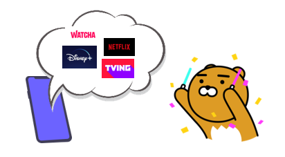

<div id="top"></div>
<!--
*** Thanks for checking out the Best-README-Template. If you have a suggestion
*** that would make this better, please fork the repo and create a pull request
*** or simply open an issue with the tag "enhancement".
*** Don't forget to give the project a star!
*** Thanks again! Now go create something AMAZING! :D
-->


<!-- PROJECT SHIELDS -->
<!--
*** I'm using markdown "reference style" links for readability.
*** Reference links are enclosed in brackets [ ] instead of parentheses ( ).
*** See the bottom of this document for the declaration of the reference variables
*** for contributors-url, forks-url, etc. This is an optional, concise syntax you may use.
*** https://www.markdownguide.org/basic-syntax/#reference-style-links
-->


<!-- PROJECT LOGO -->

<br />
<div align="center">
  <a href="https://github.com/kpuce2022CD/OOSOO">
    
  </a>

<h3 align="center">OTT 서비스 연동 어플리케이션</h3>
<h4 align="center"><i>OTT service interworking application using web crawling</i></h4>
  <p align="center">
    여러 OTT 서비스를 하나의 어플리케이션에서 연동시켜 이용할 수 있도록 하는 서비스입니다.
    <br />
    <a href="https://github.com/kpuce2022CD/OOSOO"><strong>프로토타입(준비중) »</strong></a>
    <br />
    <a href="https://github.com/github_username/repo_name/issues">Project Proposal</a> · <a href="https://trello.com/b/LZtvi1s0">Trello</a>
  </p>
</div>


<!-- TABLE OF CONTENTS -->
<details>
  <summary>Table of Contents</summary>
  <ol>
    <li>
      <a href="#about-the-project">About The Project</a>
      <ul>
        <li><a href="#background">Background</a></li>
        <li><a href="#goals">Goals</a></li>
        <li><a href="#built-with">Bulit With</a></li>
      </ul>
    </li>
    <li>
      <a href="#description">Description</a>
      <ul>
        <li><a href="#system-scenario">System Scenario</a></li>
        <li><a href="#system-config">System Config</a></li>
      </ul>
    </li>
    <li><a href="#usage">Usage(buliding..)</a></li>
    <li><a href="#collaborator">Collaborator</a></li>
  </ol>
</details>


<!-- ABOUT THE PROJECT -->
## About The Project


### Background


### Goals


### Built With


* 
* 
* 
* 
* 
* 
* 


<!-- DESCRIPTION -->
## Description


### System Scenario


### System Config


## Usage
^^ Plz look forward to it..


<!-- GETTING STARTED
## Getting Started

This is an example of how you may give instructions on setting up your project locally.
To get a local copy up and running follow these simple example steps.

### Prerequisites

This is an example of how to list things you need to use the software and how to install them.
* npm
  ```sh
  npm install npm@latest -g
  ```

### Installation

1. Get a free API Key at [https://example.com](https://example.com)
2. Clone the repo
   ```sh
   git clone https://github.com/github_username/repo_name.git
   ```
3. Install NPM packages
   ```sh
   npm install
   ```
4. Enter your API in `config.js`
   ```js
   const API_KEY = 'ENTER YOUR API';
   ```


<!-- USAGE EXAMPLES 
## Usage

Use this space to show useful examples of how a project can be used. Additional screenshots, code examples and demos work well in this space. You may also link to more resources.

_For more examples, please refer to the [Documentation](https://example.com)_


<!-- ROADMAP 
## Roadmap

- [] Feature 1
- [] Feature 2
- [] Feature 3
    - [] Nested Feature

See the [open issues](https://github.com/github_username/repo_name/issues) for a full list of proposed features (and known issues).

<p align="right">(<a href="#top">back to top</a>)</p>   -->


<!-- CONTRIBUTING 
## Contributing

Contributions are what make the open source community such an amazing place to learn, inspire, and create. Any contributions you make are **greatly appreciated**.

If you have a suggestion that would make this better, please fork the repo and create a pull request. You can also simply open an issue with the tag "enhancement".
Don't forget to give the project a star! Thanks again!

1. Fork the Project
2. Create your Feature Branch (`git checkout -b feature/AmazingFeature`)
3. Commit your Changes (`git commit -m 'Add some AmazingFeature'`)
4. Push to the Branch (`git push origin feature/AmazingFeature`)
5. Open a Pull Request

<p align="right">(<a href="#top">back to top</a>)</p> -->


<!-- LICENSE 
## License

Distributed under the MIT License. See `LICENSE.txt` for more information.

<p align="right">(<a href="#top">back to top</a>)</p> -->


<!-- ACKNOWLEDGMENTS
## Acknowledgments

* []()
* []()
* []()

<p align="right">(<a href="#top">back to top</a>)</p>  -->


<!-- MARKDOWN LINKS & IMAGES -->
<!-- https://www.markdownguide.org/basic-syntax/#reference-style-links -->

## Collaborator

 * [박찬호](https://github.com/hoho-97) : cksgh5652@gmail.com
 * [김재현](https://github.com/eoeo0326) : eoeo0326@gmail.com
 * [김진호](https://github.com/Jihn0118) : lantern50@kpu.ac.kr

<p align="right">(<a href="#top">back to top</a>)</p>
